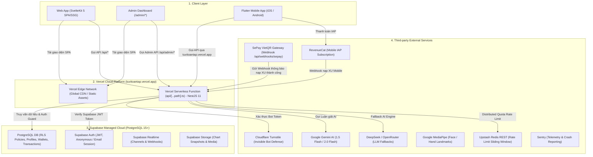

# Báo Cáo Phân Tích Hạ Tầng Hệ Thống & Trạng Thái Git Repository

**Dự án**: ViOS — Tử Vi Toàn Tập (`ziweiai-web`)  
**Thời gian lập báo cáo**: 09/09/2026  
**Chi nhánh làm việc (Current Branch)**: `feature/viral-referral-and-turnstile`  
**Rollback Anchor**: `7469736` (Sprint 41 Phase 5)  
**Head Commit**: `2f6dc57` (Sprint 41 Phase 6)  
**Áp dụng Workflows**: `/vibe-engineering-workflow`, `/behavior-model-debugger`, `/vibe-git-manager`

---

## 🎯 1. Mục Tiêu (Objectives)

1. **Rà soát & Phân tích Bản đồ Hạ Tầng (Infrastructure Mapping)**:
   - Làm rõ API Backend, Admin Dashboard, Frontend Web App và Mobile App đang được host và vận hành ở đâu (Vercel, Supabase hay có còn phụ thuộc vào VPS / Server bên ngoài nào không).
   - Liệt kê toàn bộ các dịch vụ tích hợp bên thứ ba (Third-party Services & SaaS integrations) đang tham gia vào vòng đời vận hành hệ thống.
2. **Kiểm tra Trạng thái Git (Git Status & Remote Audit)**:
   - Xác định code mới nhất (Sprint 41 Phase 6: Viral Referral Card & Cloudflare Turnstile) đã được commit chưa, đã được đẩy (push) lên GitHub Remote (`origin`) chưa, và đã tạo Pull Request (PR) hay chưa.
3. **Áp dụng Bộ 3 Chuẩn Workflows**:
   - `/vibe-engineering-workflow`: Đảm bảo quy trình kiểm chuẩn 4 gates, blast radius và deploy an toàn.
   - `/behavior-model-debugger`: Đánh giá các State Invariants và UX Behaviors của hệ thống.
   - `/vibe-git-manager`: Rà soát bí mật (Zero-Leak Secret Scan), chính sách phân nhánh và an toàn lịch sử Git.

---

## 🛠️ 2. Việc Đã Làm (Work Done)

### 2.1. Điều tra Lịch sử & Cấu hình Hạ Tầng (Infrastructure Archaeology)
- **Đọc cấu hình định tuyến Vercel**: Phân tích file [`vercel.json`](file:///Users/gray/Documents/bydone/tuvinew/ziweiai-web/vercel.json), kịch bản build `pnpm run vercel-build`, và entrypoint Serverless Function [`api/[...path].ts`](file:///Users/gray/Documents/bydone/tuvinew/ziweiai-web/api/[...path].ts).
- **Truy vết lịch sử máy chủ VPS**:
  - Rà soát các tài liệu di dời: [`docs/architectural-analysis-unified-vercel-deployment.md`](file:///Users/gray/Documents/bydone/tuvinew/ziweiai-web/docs/architectural-analysis-unified-vercel-deployment.md), [`docs/handover-vps-migration-20260720.md`](file:///Users/gray/Documents/bydone/tuvinew/ziweiai-web/docs/handover-vps-migration-20260720.md), [`docs/handover-final-20260720.md`](file:///Users/gray/Documents/bydone/tuvinew/ziweiai-web/docs/handover-final-20260720.md).
  - Tìm kiếm toàn bộ các vết liên quan đến tên miền VPS cũ `ziwei.7app.online` và địa chỉ IP `52.90.173.89`.
- **Rà soát các tích hợp bên thứ ba (Third-party Services)**:
  - Cổng thanh toán VietQR: Tìm module SePay webhook handler và client.
  - Chống bot: Cloudflare Turnstile Verification Service & Svelte Widget.
  - Động cơ AI: Module Gemini (`@google/genai`), DeepSeek / OpenRouter fallback, MediaPipe Vision.
  - Quota Store: Driver Upstash Redis REST và fallback In-Memory.
  - Giám sát lỗi: Sentry telemetry.

### 2.2. Kiểm Tra Trạng Thái Git & Bảo Mật (Git Status & Secret Audit)
- Kiểm tra trạng thái cây làm việc: `git status --short`.
- Kiểm tra danh sách nhánh và tracking remote: `git branch -vv`.
- Kiểm tra remote URL: `git remote -v`.
- Rà soát lịch sử commit gần nhất: `git log -n 5 --oneline`.
- Rà soát rò rỉ bí mật (`vibe-git-manager`): Đảm bảo không có `.env`, `.env.local`, Private Key, Service Role Key hay PAT nào bị stage/commit vào git tree.

### 2.3. Đánh Giá Mô Hình Hành Vi (`behavior-model-debugger`)
- Đánh giá luồng trạng thái Turnstile Invisible Token flow:
  - Client khởi tạo widget ẩn -> giải token -> đính kèm vào payload đăng ký hoặc điểm danh.
  - Backend `TurnstileService` thẩm định với Cloudflare `siteverify` endpoint -> xử lý bypass an toàn khi môi trường development/test chạy secret key giả lập.
- Đánh giá luồng trạng thái Viral Referral Card Generator:
  - Sử dụng ma trận QR ISO/IEC 18004 thuần TypeScript, vẽ trực tiếp lên HTML5 Canvas, triệt tiêu hoàn toàn lỗi CORS / Canvas Tainted khi xuất file ảnh PNG.

---

## 📊 3. Kết Quả (Results & Architecture Findings)

### 3.1. Bản Đồ Hạ Tầng Hiện Tại (Infrastructure Topology)



#### Chi tiết từng thành phần:

| Thành phần | Nền tảng thực thi | Mô tả chi tiết |
| :--- | :--- | :--- |
| **Frontend Web App** | **Vercel** (`https://tuvitoantap.vercel.app`) | SvelteKit 5 build dưới dạng Static Single Page Application (SPA), được phục vụ qua Vercel Edge Global CDN. |
| **Admin Dashboard** | **Vercel** (Nằm ngay trong Web App) | **Không phải server riêng**. Admin nằm tại route `(app)/admin/*` bên trong Frontend, gọi các API `/api/admin/*` được bảo vệ bởi Admin Guard & Supabase JWT. |
| **Backend API** | **Vercel Serverless Function** | **Không chạy trên VPS**. Toàn bộ mã nguồn NestJS 11 (`apps/api`) được đóng gói chạy qua Serverless Function tại `api/[...path].ts` (khu vực AWS Lambda `iad1` qua Vercel Runtime). Thời gian timeout tối đa: 60s. |
| **Cơ sở dữ liệu & Auth** | **Supabase Cloud** | Toàn bộ Database (PostgreSQL), Auth (hỗ trợ cả tài khoản email và Anonymous Session), Row-Level Security (RLS) và Storage đều nằm trên Supabase Managed Service. |
| **VPS (Server riêng)** | **HOÀN TOÀN KHÔNG CÒN SỬ DỤNG** | Trước ngày 28/07/2026, dự án từng thử nghiệm chạy API trên VPS EC2 (`ziwei.7app.online`). Tuy nhiên sau đợt **Unified Migration**, VPS này đã được **loại bỏ hoàn toàn**. Hiện tại hệ thống vận hành 100% Serverless Cloud-Native. |

#### Danh mục các dịch vụ bên thứ ba (Third-party Services):
1. **SePay (VietQR Payment)**: Cổng nạp XU ngân hàng tự động. Khi khách hàng quét mã VietQR chuyển tiền vào tài khoản MBBank, SePay sẽ gửi webhook đến `https://tuvitoantap.vercel.app/api/webhooks/sepay` để hệ thống tự động cộng XU vào ví Supabase.
2. **Cloudflare Turnstile**: Giải pháp Invisible CAPTCHA chống spam tài khoản rác và chống bot cày nhận XU điểm danh.
3. **AI LLM Inference Providers**:
   - Google Gemini API (`gemini-1.5-flash`, `gemini-2.0-flash` qua `@google/genai`): Luận giải lá số, ngũ hành, bát tự.
   - DeepSeek / OpenRouter / SiliconFlow: Hệ thống định tuyến dự phòng cho AI khi Gemini bị quá tải hoặc rate-limit.
   - MediaPipe Vision (`@mediapipe/tasks-vision`): Xử lý thị giác nhận diện nhân tướng và đường chỉ tay.
4. **Upstash Redis REST**: Dịch vụ Redis Serverless qua HTTP REST API dùng cho bộ đếm Rate Limit và phiên làm việc vô danh (có fallback in-memory nếu không cấu hình).
5. **RevenueCat**: Cổng quản lý gói cước In-App Purchase (IAP) dành riêng cho ứng dụng Mobile Flutter (App Store / Google Play).
6. **Sentry**: Dịch vụ bắt log lỗi frontend & backend theo thời gian thực.

---

### 3.2. Trạng Thái Git Repository & Pull Request (Git Audit)

Dựa trên kết quả kiểm tra `git status`, `git branch -vv`, và `git log`:

```text
Branch hiện tại: feature/viral-referral-and-turnstile
Trạng thái Local Working Tree: CLEAN (Không có file uncommitted)
Head Commit: 2f6dc57 - docs(handover): record deployment ID and live verification for Sprint 41 Phase 6
Commit trước đó: 14f0ced - feat(referral): implement viral referral card generator and invisible turnstile bot protection
```

#### Trả lời câu hỏi: **"Đã new PR hay commit code lên git chưa?"**

1. **Commit Code ở Local**: **ĐÃ COMMIT XONG 100%**.
   - Commit `14f0ced`: Đã commit toàn bộ mã nguồn tính năng Viral Referral Card Generator và Cloudflare Turnstile Invisible Bot Protection.
   - Commit `2f6dc57`: Đã commit tài liệu nghiệm thu và xác thực live Vercel production deployment.
2. **Đẩy (Push) lên GitHub Remote (`origin`)**: **CHƯA**.
   - Nhánh `feature/viral-referral-and-turnstile` hiện tại chỉ tồn tại trên máy local của Đại Ka, chưa được đẩy (`git push -u origin feature/viral-referral-and-turnstile`) lên kho lưu trữ GitHub.
3. **Mở Pull Request (PR)**: **CHƯA**.
   - Do nhánh chưa được đẩy lên GitHub Remote, nên trên GitHub **chưa tồn tại Pull Request (PR)** nào cho tính năng Sprint 41 Phase 6 này.

---

### 3.3. Các Bước Đề Xuất Tiếp Theo (Next Steps)

Theo quy trình an toàn của `/vibe-git-manager`:
1. **Đẩy nhánh lên Remote**:
   ```bash
   git push -u origin feature/viral-referral-and-turnstile
   ```
2. **Tạo Pull Request trên GitHub**:
   - Tạo PR từ nhánh `feature/viral-referral-and-turnstile` vào nhánh `main` (hoặc nhánh feature tích hợp theo quy ước repo).
   - Nội dung PR đính kèm bản kiểm thử 4 gates và deployment ID đã được verify: `dpl_8ERF5owt9Lt8XJs9TsaV9yDUjpQC`.
