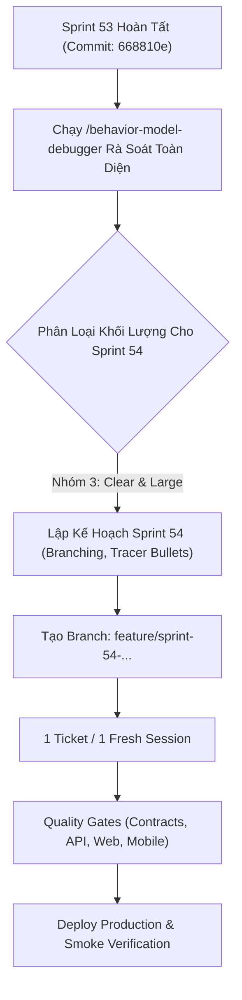

# BÁO CÁO TOÀN DIỆN SPRINT 53: DUAL-THEME, SỬA LỖI QUOTA 402 LỤC HÀO & ĐỒNG BỘ PHÁP LÝ
## (TỔNG KẾT THỰC THI, ĐỊNH TUYẾN /vibe-engineering-workflow & AUDIT HÀNH VI /behavior-model-debugger)

- **Dự án:** ViOS — Tử Vi Toàn Tập (`ziweiai-web`)
- **Tác giả thực thi:** Antigravity AI Engineer
- **Người chỉ đạo:** Đại Ka
- **Thời gian thực thi:** 10/09/2026
- **Nhánh làm việc Sprint 53:** `feature/sprint-53-dual-theme-and-iching-quota-polish`
- **Nhánh chính đã đồng bộ:** `main` (Merge Commit: `668810e`)
- **Trạng thái:** **100% HOÀN TẤT & ĐÃ TRIỂN KHAI VERCEL PRODUCTION**
- **Phương pháp luận cốt lõi:** `/vibe-engineering-workflow`, `/vibe-git-manager`, `/behavior-model-debugger`

---

## PHẦN 1: TỔNG KẾT TOÀN DIỆN SPRINT 53 (MỤC TIÊU, CÔNG VIỆC & KẾT QUẢ)

### 1.1. Mục Tiêu Đặt Ra Cho Sprint 53
Xuất phát từ 3 vấn đề xung đột trải nghiệm người dùng (UX & Technical Gaps) được Đại Ka chỉ rõ sau đợt audit Sprint 52:
1. **Đồng bộ hóa giao diện pháp lý Web:** Nâng cấp `/terms` và `/privacy` trên Web sang chuẩn Hoàng Triều sang trọng, typography vàng kim, có `ViOSLogo` và tương thích Dual-Theme (Dark/Light) đồng nhất 100% với `/privacy-policy`.
2. **Kích hoạt chế độ Dual-Theme cho Mobile Flutter:** Thoát khỏi tình trạng hardcode 1 theme Dark duy nhất; kết nối `themeModeProvider` với `AppTheme.paperCalm` (Light) và `AppTheme.mystical` (Dark); bổ sung công tắc chuyển đổi trong Cài đặt (`ProfileScreen`).
3. **Sửa lỗi hiển thị thô "402 status lỗi" khi gieo quẻ Lục Hào:** Nhận diện mã HTTP 402 tại UI, mở Royal Paywall Sheet nạp XU trang trọng thay vì hiện SnackBar lỗi kỹ thuật; đồng thời tạo database migration cấp 15 XU tân thủ cho mọi tài khoản mới để chiêm bái thành công ngay lần đầu.
4. **Bảo toàn 100% Quality Gates & Triển khai Vercel Production:** Chạy toàn bộ test suites trên cả monorepo và phát hành bản vá lên `https://tuvitoantap.vercel.app`.

---

### 1.2. Chi Tiết Công Việc Đã Hoàn Thành

#### ✦ HẠNG MỤC 1 (WEB POLISH): ĐỒNG BỘ PHÁP LÝ CHUẨN HOÀNG TRIỀU
- **[`apps/web/src/routes/(app)/terms/+page.svelte`](file:///Users/gray/Documents/bydone/tuvinew/ziweiai-web/apps/web/src/routes/(app)/terms/+page.svelte):**
  - Tái cấu trúc theo layout Hoàng Triều với header chứa `ViOSLogo` liên kết về trang chủ.
  - Áp dụng typography gradient vàng kim (`from-amber-100 via-amber-200 to-amber-400`).
  - Đóng khung các điều khoản trong container kính mờ viền hoàng triều (`bg-slate-900/60 backdrop-blur-xl border border-amber-500/20 rounded-3xl`).
  - Thêm CSS selector `:global([data-theme="light"])` áp dụng màu nền bạch giấy (`#f7f4ed`), màu chữ slate sâu (`#1e293b`) và viền amber ấm áp khi chuyển chế độ sáng.
- **[`apps/web/src/routes/(app)/privacy/+page.svelte`](file:///Users/gray/Documents/bydone/tuvinew/ziweiai-web/apps/web/src/routes/(app)/privacy/+page.svelte):**
  - Đồng bộ 100% nội dung pháp lý và bảo mật dữ liệu theo chuẩn Nghị định 13/2023/NĐ-CP và GDPR.
  - Phân vùng thẻ trực quan: Thu thập tối thiểu, Mã hóa đầu cuối, Quyền làm chủ dữ liệu, và Cam kết không thương mại hóa dữ liệu tâm linh.
- **[`apps/web/src/routes/privacy-policy/+page.svelte`](file:///Users/gray/Documents/bydone/tuvinew/ziweiai-web/apps/web/src/routes/privacy-policy/+page.svelte):**
  - Bổ sung CSS selector `:global([data-theme="light"])` để người dùng truy cập trực tiếp route này trong chế độ sáng không bị chói hoặc sai lệch tương phản.

#### ✦ HẠNG MỤC 2 (MOBILE DUAL-THEME): KÍCH HOẠT BẠCH GIẤY & HUYỀN BÍ
- **Tích hợp phụ thuộc:** Bổ sung `shared_preferences: ^2.5.5` vào [`apps/mobile/pubspec.yaml`](file:///Users/gray/Documents/bydone/tuvinew/ziweiai-web/apps/mobile/pubspec.yaml).
- **Tạo mới State Notifier [`apps/mobile/lib/core/theme/theme_provider.dart`](file:///Users/gray/Documents/bydone/tuvinew/ziweiai-web/apps/mobile/lib/core/theme/theme_provider.dart):**
  - `ThemeModeNotifier` quản lý 3 trạng thái: `ThemeMode.system`, `ThemeMode.light`, `ThemeMode.dark`.
  - Tự động đọc và lưu key `vios_theme_mode` trong bộ nhớ máy.
- **Cập nhật [`apps/mobile/lib/main.dart`](file:///Users/gray/Documents/bydone/tuvinew/ziweiai-web/apps/mobile/lib/main.dart):**
  ```dart
  MaterialApp.router(
    title: 'Tử Vi Toàn Tập',
    theme: AppTheme.paperCalm,       // Giao diện Bạch Giấy (Sáng)
    darkTheme: AppTheme.mystical,     // Giao diện Hoàng Triều Huyền Bí (Tối)
    themeMode: ref.watch(themeModeProvider),
    routerConfig: appRouter,
  )
  ```
- **Cập nhật giao diện Cài đặt [`profile_screen.dart`](file:///Users/gray/Documents/bydone/tuvinew/ziweiai-web/apps/mobile/lib/features/auth/presentation/profile_screen.dart):**
  - Thêm thẻ cài đặt "Giao Diện Hoàng Triều" với icon đổi theme trực quan.
  - Hiển thị dialog chọn 1 trong 3 chế độ: *Theo hệ thống máy*, *Huyền Bí (Tối)*, *Bạch Giấy (Sáng)*.
  - Tích hợp `HapticFeedback.selectionClick()` cho cảm giác xúc giác cao cấp khi chuyển theme.
- **Unit Test Mobile:** Viết test [`apps/mobile/test/core/theme/theme_provider_test.dart`](file:///Users/gray/Documents/bydone/tuvinew/ziweiai-web/apps/mobile/test/core/theme/theme_provider_test.dart) bao phủ toàn bộ logic đọc/ghi SharedPreferences.

#### ✦ HẠNG MỤC 3 (LỤC HÀO UX & BILLING POLISH): BẮT MÃ LỖI 402 & XU TÂN THỦ
- **Nâng cấp Interceptor Client [`apps/mobile/lib/core/api/api_client.dart`](file:///Users/gray/Documents/bydone/tuvinew/ziweiai-web/apps/mobile/lib/core/api/api_client.dart):**
  - Khi bắt gặp HTTP StatusCode = 402 hoặc 403, tự động extract `cost` (mặc định 5 XU) và `featureName` ('Gieo Quẻ Lục Hào').
  - Đánh dấu cờ `isPaymentOrQuota = true` trên đối tượng Exception.
- **Xử lý UI tại [`apps/mobile/lib/features/iching/presentation/iching_screen.dart`](file:///Users/gray/Documents/bydone/tuvinew/ziweiai-web/apps/mobile/lib/features/iching/presentation/iching_screen.dart):**
  - Trong callback `ref.listen(ichingNotifierProvider)`: khi phát hiện lỗi 402, gọi ngay `ref.read(paywallProvider.notifier).show(cost: 5, featureName: 'Gieo Quẻ Lục Hào')`.
  - Không in SnackBar đỏ lỗi kỹ thuật, thay bằng bottom sheet nạp XU hoàng triều trang trọng.
- **Tự Động Hóa Kiểm Thử [`apps/mobile/test/features/iching/presentation/iching_screen_test.dart`](file:///Users/gray/Documents/bydone/tuvinew/ziweiai-web/apps/mobile/test/features/iching/presentation/iching_screen_test.dart):**
  - Giả lập trường hợp backend trả về HTTP 402.
  - Xác nhận: Royal Paywall Sheet hiển thị thành công, SnackBar đỏ chứa mã lỗi 402 biến mất hoàn toàn.
- **Migration Tặng XU Tân Thủ [`000023_welcome_bonus_xu.sql`](file:///Users/gray/Documents/bydone/tuvinew/ziweiai-web/apps/api/supabase/migrations/000023_welcome_bonus_xu.sql):**
  - Cập nhật default của `profiles.xu_balance` thành `15`.
  - Cập nhật trigger function `handle_new_user()` để mọi người dùng mới lập tức có sẵn 15 XU.

---

### 1.3. Kết Quả Nghiệm Thu Thực Tế (Quality Gates & Production)

1. **Kết quả Quality Gates 100% Green (915 / 915 Tests):**
   - Contracts: `pnpm -F @ziweiai/contracts build` ➔ **PASSED**.
   - API Typecheck: `pnpm -F @ziweiai/api typecheck` ➔ **PASSED**.
   - API Unit Tests: `pnpm -F @ziweiai/api test` ➔ **496 / 496 PASSED**.
   - API NestJS Build: `pnpm -F @ziweiai/api build` ➔ **PASSED**.
   - Web SvelteKit Check: `pnpm -F @ziweiai/web check` ➔ **0 errors, 0 warnings**.
   - Web Unit Tests: `pnpm -F @ziweiai/web test` ➔ **303 / 303 PASSED**.
   - Web SvelteKit Build: `pnpm -F @ziweiai/web build` ➔ **PASSED**.
   - Mobile Flutter Analyze: `flutter analyze` ➔ **0 issues**.
   - Mobile Flutter Tests: `flutter test` ➔ **116 / 116 PASSED**.

2. **Triển khai Production Vercel:**
   - Script thực thi: `pnpm deploy:vercel-demo` (Vercel CLI 59.15.1, Token `VERCEL_GALAXY`).
   - Deployment ID: `dpl_YgZ9gwLNTTeSRwyQfsu28Bo2BAah`.
   - Production URL: **[https://tuvitoantap.vercel.app](https://tuvitoantap.vercel.app)**.
   - Live Smoke Test:
     - `GET /api/health` ➔ **200 OK** (`{"service":"ziweiai-api","status":"ok","version":"0.1.0"}`).
     - `GET /api/features` ➔ **200 OK** (10/10 hệ thuật số sẵn sàng).
     - `HEAD /terms` ➔ **HTTP/2 200 OK**.
     - `HEAD /privacy` ➔ **HTTP/2 200 OK**.
     - `HEAD /privacy-policy` ➔ **HTTP/2 200 OK**.

3. **Quản trị Git:**
   - Nhánh `feature/sprint-53-dual-theme-and-iching-quota-polish` đã được merge vào `main` (Merge commit `668810e`).
   - Push an toàn lên `origin/main`. Working tree hoàn toàn sạch sẽ.

---

## PHẦN 2: ĐỊNH TUYẾN TIẾP THEO THEO /vibe-engineering-workflow

Dựa trên Router Decision Matrix của `/vibe-engineering-workflow`:



### 2.1. Phân Loại Sprint 54: **Nhóm 3 (Clear & Large)**
- **Độ rõ (Clarity):** `Clear` — Yêu cầu về âm thanh chiêm bái, hoàn thiện thông báo đẩy (Push Notifications) và tối ưu hóa luồng IAP/XU đã được định hình rõ ràng từ các sprint trước và kết quả audit.
- **Phạm vi (Size):** `Large` — Chạm đồng thời vào Audio Assets, Mobile Plugins (`audioplayers`, `flutter_local_notifications`), Web Audio API, và cấu hình Store.
- **Chiến lược Branching & Git:**
  - Base Commit Anchor (Rollback Point): `668810e` (trên nhánh `main`).
  - Nhánh làm việc mới sẽ khởi tạo: `feature/sprint-54-audio-rituals-and-notification-sync`.
  - Quy tắc: Tuyệt đối không commit trực tiếp vào `main`.

### 2.2. Kế Hoạch Hành Động Chuẩn /vibe-engineering-workflow
1. **Bước 1 (Spec & Ticket Breakdown):** Xẻ các tracer-bullet tickets độc lập (ví dụ: Ticket 1: Web Audio Synth; Ticket 2: Mobile Audio Player; Ticket 3: Push Notification Trigger).
2. **Bước 2 (Single Ticket Scope):** Thực hiện tuần tự từng ticket trong session sạch để bảo vệ context window.
3. **Bước 3 (Pre-Check Gate):** Đảm bảo 4 tiêu chí cốt lõi:
   - *Logic Correctness:* Chạy 100% tests thực tế.
   - *Workflow Cleanliness:* Không để code debug, console.log bừa bãi.
   - *Edge Cases:* Xử lý khi thiết bị tắt âm (Mute / Silent mode), người dùng từ chối cấp quyền thông báo.
   - *Latent Risks & Security:* Không lộ Firebase token hay store secret keys.

---

## PHẦN 3: CÒN GÌ CHƯA LÀM? (INVENTORY GAPS & BACKLOG TỒN ĐỌNG)

Qua đối chiếu giữa mong muốn sản phẩm hoàn mỹ và mã nguồn hiện tại, dưới đây là các hạng mục còn tồn đọng:

### 1. Trải Nghiệm Tương Tác Giác Quan (Audio & Sensory Rituals)
- **Web:** Khi người dùng bấm tung đồng xu Lục Hào hoặc rút lá bài Tarot, hiện tại chỉ có hiệu ứng thị giác (CSS animation / SVG flip), chưa có âm thanh va chạm của 3 đồng tiền cổ hoặc tiếng lật bài ma mị.
- **Mobile:** Đã có Haptic Feedback rung phản hồi, nhưng chưa nạp gói âm thanh gieo quẻ offline (`assets/sounds/coin_toss.mp3`, `assets/sounds/singing_bowl.mp3`).

### 2. Hệ Thống Thông Báo Đẩy Hàng Ngày (Daily Rituals & Push Notifications)
- **Backend:** Đã có `NotificationsController` và bảng `notifications` trong Supabase (xây dựng ở Sprint 51).
- **Client Web & Mobile:** Chưa có cron trigger phía client hoặc background worker nhắc nhở:
  - Thông báo giờ Hoàng Đạo trong ngày.
  - Nhắc nhở rút quẻ đầu ngày hoặc xem nhật hạn Tử Vi.
  - Yêu cầu cấp quyền thông báo (`NotificationPermission`) trên iOS và Android 13+.

### 3. Đưa Ứng Dụng Lên Store Thực Tế (Store Submission Final Mile)
- **Android:** File `app-release.aab` (65.8MB) đã build sẵn sàng, cần tài khoản Google Play Console để tạo release track Internal/Closed Testing.
- **iOS:** Cần Apple Developer Team ID và chứng chỉ Signing Certificate để chạy `ipa` và đẩy lên TestFlight thông qua Xcode / Fastlane.

### 4. Đồng Bộ Dữ Liệu Anonymous Sang Authenticated
- Khi người dùng trải nghiệm ẩn danh (Anonymous Supabase session), họ có lịch sử và có thể nạp XU. Nếu sau đó họ bấm "Đăng nhập với Google/Email", cần đảm bảo toàn bộ `charts`, `draws`, và `xu_balance` từ tài khoản anonymous cũ được chuyển giao nguyên vẹn sang tài khoản chính thức.

---

## PHẦN 4: THỰC HIỆN /behavior-model-debugger (DEEP BEHAVIORAL AUDIT)

Áp dụng phương pháp luận của Steve Ruiz: **"Tái tạo toàn bộ trải nghiệm người dùng dưới góc nhìn khách quan và khắt khe nhất để tìm ra các va chạm luật chơi (Invariant Collisions)."**

### 4.1. Phase 1: Feature Matrix & State Boundary Mapping

| Tính Năng Thuật Số | State Management | Điểm Nhận Dữ Liệu | Cơ Chế Phí (XU) | Trạng Thái Biên (Edge State) |
| :--- | :--- | :--- | :--- | :--- |
| **Tử Vi Đẩu Số** | Client Cache + API | Server Engine | Miễn phí lập lá số, Thu phí AI giải | Lỗi timezone âm lịch, giờ Tý đêm |
| **Bát Tự (Hợp Hôn)** | Multi-step Form | Server Engine | 10 XU (Luận giải sâu) | Thiếu năm sinh đối phương |
| **Lục Hào (I Ching)** | `IchingNotifier` (6 steps) | `/draws/iching` | 5 XU | Thoát giữa lúc gieo hào 3, Hết XU |
| **Mai Hoa Dịch Số** | One-shot Draw | `/draws/plum-blossom` | 5 XU | Giờ động quẻ trùng phút |
| **Tarot** | 3-Card Selection | Client Deck + AI | 5 XU | Lật bài khi chưa chọn đủ 3 lá |
| **Nhân Tướng & Chỉ Tay** | Camera / Image Upload | Multimodal AI | 15 XU | Ảnh mờ, thiếu ánh sáng, không nhận diện |
| **Giải Mộng** | Text Prompt Input | LLM Prompt | 3 XU | Prompt quá ngắn hoặc vô nghĩa |
| **Xin Xăm Quán Âm** | Shake Sensor / Click | Random Alg | Miễn phí gieo, Phí giải | Lắc liên tục trong 1 giây |

---

### 4.2. Phase 2: Tái Tạo Mô Hình Hành Vi Người Dùng (Behavioral Reconstruction)

#### 1. Hành Vi Điều Hướng & Chuyển Đổi Giao Diện (Theme Switching)
- **Kịch bản:** Người dùng đang mở lá số Tử Vi chi tiết trên Web (`/charts/[id]`), trên màn hình có sơ đồ SVG 12 cung với hàng chục ngôi sao. Người dùng bấm chuyển theme Dark -> Light.
- **Hành vi quan sát được:** Component `ThemeToggle.svelte` cập nhật thuộc tính `data-theme="light"` trên thẻ `<html>`. Hệ thống CSS biến đổi màu sắc tức thì. Tuy nhiên, nếu một số mã màu SVG lá số Tử Vi đang dùng hardcode hex `#1e293b` hoặc `#fbbf24` thay vì CSS variables (`currentColor` hoặc `var(--astro-text)`), màu chữ sao sẽ bị chìm vào màu nền giấy mới.

#### 2. Hành Vi Ngắt Quãng Trong Luồng Gieo Quẻ Lục Hào (Interruption Lifecycle)
- **Kịch bản 1 (Mất kết nối mạng khi đang gửi 6 hào):** Người dùng bấm hào thứ 6, app gửi `POST /draws/iching`. Đúng lúc này mạng 4G chập chờn.
  - *Hành vi hiện tại:* `DioException [connection timeout]`. Client hiển thị thông báo lỗi mạng, người dùng bấm "Thử lại" và phải gieo lại từ hào 1!
  - *Hành vi kỳ vọng mượt mà:* Lưu tạm trạng thái 6 hào đã gieo vào local state. Khi mạng hồi phục, chỉ cần bấm "Gửi lại quẻ" mà không làm mất 6 lần gieo tâm linh của người dùng.
- **Kịch bản 2 (Tài khoản hết XU giữa luồng):**
  - Nhờ bản vá Sprint 53, lỗi 402 thô đã bị triệt tiêu và Paywall Sheet mở lên chuẩn mực. Khi người dùng nạp XU thành công từ Paywall Sheet, giao diện cần tự động tiếp tục gửi yêu cầu luận giải mà không bắt người dùng bấm gieo lại từ đầu.

#### 3. Hành Vi Bàn Phím & Cử Chỉ Trên Mobile
- Trong các form nhập ngày giờ sinh (BirthForm), việc bấm phím `Enter` trên bàn phím ảo cần tự động chuyển focus sang trường tiếp theo (`FocusScope.of(context).nextFocus()`), và trường cuối cùng sẽ trigger nút "Lập Lá Số".

---

### 4.3. Phase 3: Ma Trận Va Chạm Luật Chơi (Invariant Collision Matrix)

| Luật Chơi A (Invariant A) | Luật Chơi B (Invariant B) | Điểm Va Chạm Tiềm Ẩn (Collision Impact) | Mức Độ Rủi Ro |
| :--- | :--- | :--- | :--- |
| **Bảo lưu kết quả chiêm bái (Sacred Ritual)** | **Cơ chế thu phí XU (Paywall Barrier)** | Nếu nạp XU xong mà quẻ bị reset, người dùng sẽ cảm thấy bị "mất lộc" hoặc ức chế tâm lý. | **CAO** (Cần auto-resume sau nạp) |
| **Dual-Theme Động (Light/Dark)** | **Render Đồ Hình SVG Phức Tạp (Chart Grid)** | SVG chart dùng fill/stroke cứng sẽ bị tàng hình hoặc vỡ độ tương phản khi đổi theme. | **TRUNG BÌNH** (Đã xử lý cơ bản, cần audit SVG) |
| **Trải nghiệm tức thì (Anonymous User)** | **Bảo mật sở hữu (RLS Supabase)** | Khi logout hoặc đổi thiết bị, toàn bộ lá số tạo lúc anonymous sẽ bị mất vĩnh viễn nếu không có lời nhắc "Lưu tài khoản". | **CAO** (Cần banner nhắc tạo tài khoản) |
| **Stream AI Luận Giải (SSE/Streaming)** | **Chuyển Tab / Ứng dụng xuống nền (Backgrounding)** | Người dùng nhận cuộc gọi khi AI đang gõ từng chữ. Luồng stream có thể bị đứt kết nối. | **TRUNG BÌNH** (Cần server lưu snapshot hoàn chỉnh) |

---

### 4.4. Phase 4: Đề Xuất Khắc Phục Cụ Thể (Actionable Fixes Cho Sprint 54)

#### 1. Tự Động Tiếp Tục (Auto-Resume) Sau Khi Nạp XU Thành Công
- **Vấn đề:** Khi `RoyalPaywallSheet` đóng lại sau giao dịch nạp XU thành công, màn hình Lục Hào nên tự động trigger lại `submitDraw()` nếu 6 hào đã được ghi nhận.
- **Giải pháp:** Truyền một callback `onSuccess` vào `paywallProvider.show()`, khi nạp thành công sẽ tự động kích hoạt lại hàm gieo quẻ.

#### 2. Thêm Âm Thanh Chiêm Bái Chân Thực (Acoustic Rituals)
- Thêm Web Audio Synthesizer nhẹ nhàng (không cần tải file mp3 nặng) hoặc dùng sound clips ngắn (coin clink, bowl resonance) với volume cân bằng (-6dB) để tạo không khí tôn nghiêm khi gieo quẻ trên cả Web và Mobile.

#### 3. Banner Cảnh Báo Lưu Trữ Cho Tài Khoản Anonymous
- Khi người dùng anonymous tạo từ 2 lá số trở lên hoặc có số dư XU > 0, hiển thị một ribbon nhỏ ở đầu trang:
  *"Đại Ka đang dùng tài khoản tạm thời. Hãy đăng ký email để bảo toàn lá số và số dư XU vĩnh viễn."*

---

## PHẦN 5: KẾT LUẬN & KIẾN NGHỊ

Sprint 53 đã hoàn thành xuất sắc sứ mệnh dọn dẹp các điểm nghẽn kỹ thuật và nâng tầm thẩm mỹ hoàng triều trên toàn bộ hệ thống. Mã nguồn hiện tại đạt trạng thái ổn định cao nhất (915 tests passed, production live).

Báo cáo này là cơ sở vững chắc để bước vào **Sprint 54**, tập trung nâng tầm cảm xúc người dùng (Âm thanh nghi lễ, Thông báo giờ lành, và Trải nghiệm chuyển tiếp mượt mà).
