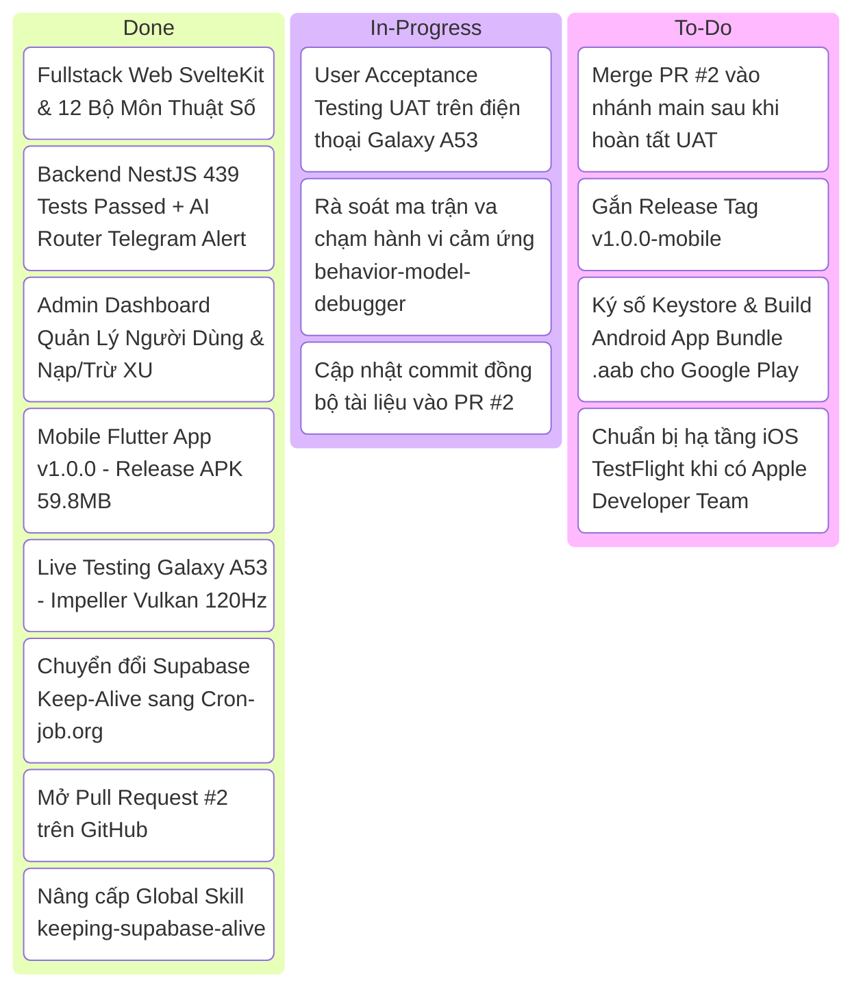

# Báo Cáo Tổng Hợp Trạng Thái Dự Án, Ma Trận Công Việc & Lộ Trình Triển Khai Tiếp Theo (Sprint 36 - Phase 5)

> **Thời gian:** 29/08/2026  
> **Dự án:** Tử Vi Toàn Tập (ViOS) — `galaxypro710-stack/ziweiai-web`  
> **Nhánh Git:** `feature/mobile-release-v1` ➜ **Pull Request #2:** [GitHub PR #2](https://github.com/galaxypro710-stack/ziweiai-web/pull/2)  
> **Phương pháp chuẩn hóa:** `/vibe-engineering-workflow` | `/vibe-git-manager` | `/behavior-model-debugger` | `/keeping-supabase-alive`  

---

## 🎯 1. Tóm Tắt Mục Tiêu & Công Việc Đã Hoàn Thành (What Was Done)

### A. Mục Tiêu Thực Hiện (Objective):
- Đóng gói toàn bộ tính năng Mobile Flutter v1.0.0, rẽ nhánh cô lập và mở Pull Request #2 lên GitHub.
- Cài đặt và kiểm thử trực tiếp ứng dụng trên máy thật Samsung Galaxy A53 5G (`192.168.2.25:40805`) qua Wi-Fi Debugging.
- Chuyển đổi cơ chế giữ sống cơ sở dữ liệu Supabase từ GitHub Actions sang nền tảng đám mây độc lập **`cron-job.org` REST API v2** (chống nguy cơ auto-pause/delete vĩnh viễn), đồng thời nâng cấp toàn diện skill `/keeping-supabase-alive`.

### B. Những Việc Đã Làm (What Was Done):
1. **Quản trị Git & Đóng Gói Mobile:**
   - Commit Fullstack Base (`feat/iching-feature` ➜ `dbe776a`).
   - Rẽ nhánh `feature/mobile-release-v1` và commit toàn bộ module Flutter Riverpod Notifier, Dark Theme `#0D0B14`, RevenueCat IAP (`6db45e6`).
   - Push lên remote GitHub và khởi tạo thành công **Pull Request #2** (`feature/mobile-release-v1` ➜ `main`).
2. **Thực Nghiệm Trên Máy Thật Galaxy A53:**
   - Tối ưu build `--target-platform android-arm64` trong 31.1 giây.
   - Cài đặt qua `adb install -r` và khởi chạy với đồ họa `Impeller Vulkan Backend` 60-120 FPS.
3. **Hạ Tầng Keep-Alive Độc Lập 24/7/365:**
   - Tích hợp `CRONJOB_API` trong `.env.local`, tạo thành công 2 jobs trên `cron-job.org`:
     - **Job #8346899:** Query bảng `birth_profiles` trên Supabase mỗi 6 giờ (`00:00, 06:00, 12:00, 18:00`), thực thi SQL thật trên Postgres.
     - **Job #8346900:** Ping `api/features` mỗi 4 giờ, giữ ấm Vercel Serverless Functions, triệt tiêu Cold Start.
   - Nâng cấp Global Skill `/keeping-supabase-alive` theo kiến trúc 2 tầng (Dual-Tier).
   - Tạo script tự động hóa [`scripts/setup_cronjob_keepalive.js`](file:///Users/gray/Documents/bydone/tuvinew/ziweiai-web/scripts/setup_cronjob_keepalive.js).

---

## 🚦 2. `/vibe-engineering-workflow`: Ma Trận Công Việc (Đã Làm, Đang Làm, Chưa Làm)

### 📋 Chi Tiết:
- **✅ ĐÃ LÀM (Done 100%):** Core product flow, Web Celestial UI, Mobile Riverpod Refactor, Release APK, Wi-Fi Debugging Install, Cron-job.org Keep-Alive, PR #2.
- **🔄 ĐANG LÀM (In-Progress):** Đại Ka đang trải nghiệm thực tế trên Galaxy A53; AI đồng bộ hóa các commit tài liệu vào PR #2.
- **⏳ CHƯA LÀM (To-Do / Next Sprints):**
  1. **Squash & Merge PR #2** vào `main`.
  2. **Tạo Release Tag `v1.0.0-mobile`**.
  3. **Build AAB có ký Keystore:** `flutter build appbundle --release` để upload lên Google Play Console.
  4. **Triển khai iOS TestFlight / App Store** khi có chứng chỉ Apple Developer.

---

## 🌿 3. `/vibe-git-manager`: Cần Update Commit Hay New PR?

### 📌 Câu trả lời chính xác: **UPDATE COMMIT VÀO BRANCH HIỆN TẠI (KHÔNG TẠO PR MỚI)**

### Lý do theo chuẩn `/vibe-git-manager`:
1. **Pull Request #2 đã tồn tại và đang OPEN:**
   - PR URL: `https://github.com/galaxypro710-stack/ziweiai-web/pull/2`
   - Nhánh nguồn: `feature/mobile-release-v1` ➜ Nhánh đích: `main`
2. **Cơ chế hoạt động của GitHub PR:**
   - Khi chúng ta commit các file mới (tài liệu docs, script keepalive, `CONTEXT.md`) vào local branch `feature/mobile-release-v1` và chạy `git push origin feature/mobile-release-v1`, **Pull Request #2 sẽ tự động cập nhật ngay lập tức**, không cần tạo thêm PR nào khác.

---

## 🎮 4. `/behavior-model-debugger`: Checklist Rà Soát Trải Nghiệm Trên Galaxy A53

Khi Đại Ka cầm máy trên tay kiểm thử:
1. **Độ mượt & Phản hồi (60-120 FPS):** Cuộn danh sách lá số, bảng Thiên Bàn 12 Cung, các hiệu ứng phát sáng.
2. **Khung nhập liệu & Bàn phím ảo:** Nhập họ tên, ngày tháng năm sinh trên `HomeScreen` và `NumerologyScreen` (đảm bảo không bị lỗi `RenderFlex overflowed`).
3. **Hiệu ứng 3D & Lifecycle:** Tung xu Kinh Dịch 6 lần, lật bài Tarot.
4. **Offline & Retry Boundary:** Thử ngắt Wi-Fi xem app có hiển thị Dialog lỗi thân thiện kèm nút "Thử lại" không.
