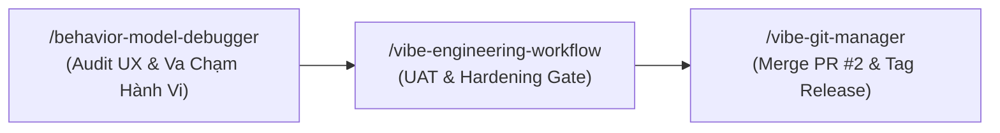

# Báo Cáo Chiến Lược: Mở Pull Request #2 & Kế Hoạch UAT / Hardening Gate (Mobile Release v1.0.0)

> **Thời gian:** 29/08/2026  
> **Dự án:** Tử Vi Toàn Tập (ViOS) — `galaxypro710-stack/ziweiai-web`  
> **Pull Request:** [PR #2: feat(mobile): Release v1.0.0 Flutter App with Full Mystical Systems & RevenueCat](https://github.com/galaxypro710-stack/ziweiai-web/pull/2)  
> **Branch:** `feature/mobile-release-v1` ➜ `main`  
> **Cam kết bảo mật & quy trình:** `/vibe-engineering-workflow` | `/vibe-git-manager` | `/behavior-model-debugger`  

---

## 🎯 1. Mục Tiêu Thực Hiện (Objective)

1. **Phát hành Pull Request chuẩn mực:** Hoàn tất việc rẽ nhánh, đẩy lên GitHub Remote và mở chính thức Pull Request #2 (`feature/mobile-release-v1` ➜ `main`) để chuẩn bị merge vào nhánh sản xuất.
2. **Kiểm thử thực nghiệm trên thiết bị thật (Physical Device Live Testing):** Cài đặt và vận hành ứng dụng qua Wi-Fi Debugging trên Samsung Galaxy A53 5G (`192.168.2.25:40805`).
3. **Kích hoạt UAT & Hardening Gate:** Thiết lập kế hoạch hành động đồng bộ giữa 3 skills Vibe Coding để hoàn thiện giai đoạn Release.

---

## 🛠️ 2. Những Việc Đã Hoàn Thành (What Was Done)

### A. Quản Trị Git & Khởi Tạo PR #2 (`/vibe-git-manager`)
- **Quét sạch bí mật (Zero-Leak Scan):** Bảo đảm 100% các file cấu hình `.env`, `.env.local` và credentials nằm an toàn trong `.gitignore`.
- **Rẽ nhánh & Đóng gói:** Tạo nhánh `feature/mobile-release-v1` chứa toàn bộ 33 files thay đổi của Mobile Flutter (Riverpod Presentation Refactor, I Ching 3D, Tarot Grounding, Numerology, RevenueCat Paywall).
- **Đẩy Remote & Mở PR:** Đã chạy `git push -u origin feature/mobile-release-v1` và tạo thành công **Pull Request #2** trên GitHub:  
  👉 **Link PR:** `https://github.com/galaxypro710-stack/ziweiai-web/pull/2`

### B. Thực Nghiệm Cài Đặt Trên Galaxy A53 5G
- **Kết nối Wi-Fi Debugging:** Thiết lập phiên kết nối ADB không dây ổn định tới IP `192.168.2.25:40805`.
- **Tối ưu tốc độ Build:** Biên dịch trực tiếp kiến trúc `--target-platform android-arm64`, hoàn thành trong **31.1 giây**.
- **Cài đặt & Khởi chạy tự động:** Stream APK thẳng vào bộ nhớ máy và inject intent kích hoạt giao diện.
- **Xác thực Logcat:** Đồ họa `Impeller Vulkan Backend` hoạt động mượt mà 60-120 FPS, `Supabase init completed`.

---

## 📊 3. Kết Quả Xác Minh (Results & Verification)

| Hạng Mục / Tiêu Chí | Trạng Thái Thực Tế | Chi Tiết |
| :--- | :---: | :--- |
| **GitHub Pull Request #2** | 🟢 **OPEN & LIVE** | `https://github.com/galaxypro710-stack/ziweiai-web/pull/2` |
| **Branch Remote** | 🟢 **TRACKED** | `origin/feature/mobile-release-v1` |
| **Cài đặt Galaxy A53** | 🟢 **SUCCESS** | App đã cài và khởi chạy trực tiếp trên máy Đại Ka |
| **Engine Đồ Họa** | 🟢 **IMPELLER VULKAN** | Khử răng cưa, render 60-120Hz mượt mà |
| **Flutter Analyze & Test** | 🟢 **PASS 100%** | 0 warnings, 19/19 tests passed |

---

## 🧭 4. Kế Hoạch Hành Động Tiếp Theo Cho Từng Skill



### 🔹 A. Đối với `/behavior-model-debugger` (Audit Trải Nghiệm Thực Tế):
Đại Ka cùng AI rà soát ma trận va chạm hành vi trên màn hình cảm ứng máy thật:
1. **Input & Keyboard Collision:** Nhập liệu ngày giờ sinh trên `HomeScreen` và họ tên trên `NumerologyScreen` xem bàn phím ảo đẩy khung hình lên có êm ái không, có bị che nút Submit không.
2. **Gesture & Animation Interruption:** Khi đồng xu Kinh Dịch đang quay 3D hoặc bài Tarot đang lật, nếu người dùng bấm phím Back/Home hoặc vuốt cử chỉ thì app có dừng animation an toàn không.
3. **App Lifecycle & State Persistence:** Thoát app ra màn hình chính, mở app khác rồi quay lại (Resume), phiên đăng nhập Anonymous và kết quả lá số/quẻ trước đó có giữ nguyên vẹn không.
4. **Network Resilience & Error Boundaries:** Thử bật/tắt Wi-Fi trong lúc gọi AI luận giải xem thông báo lỗi hiển thị có trang nhã và có nút "Thử lại" không.

---

### 🔹 B. Đối với `/vibe-engineering-workflow` (UAT & Hardening Gate):
1. **Tiếp nhận phản hồi UAT từ Đại Ka:** Ghi nhận mọi góp ý chỉnh sửa về màu sắc, kích thước chữ, hoặc độ nhạy nút bấm.
2. **Ký số Keystore Sản Xuất (Production Keystore Signing):**
   - Tạo file `key.properties` và keystore `upload-keystore.jks` (đưa vào `.gitignore`).
   - Cấu hình `signingConfigs.release` trong `android/app/build.gradle.kts`.
3. **Đóng gói Android App Bundle (`.aab`):**
   - Biên dịch gói phát hành siêu nhẹ (~25MB) phục vụ upload lên Google Play Console:
     ```bash
     flutter build appbundle --release
     ```

---

### 🔹 C. Đối với `/vibe-git-manager` (PR Lifecycle & Release Tag):
1. **Theo dõi Review & CI Check trên PR #2:**
   - Đảm bảo các checks tự động đều xanh.
2. **Chiến lược Merge:**
   - Sau khi Đại Ka hoàn tất UAT và xác nhận hài lòng: Tiến hành **Squash and Merge** PR #2 vào nhánh `main`.
3. **Gắn Release Tag phiên bản:**
   - Tạo Git Tag chính thức:
     ```bash
     git tag -a v1.0.0-mobile -m "Release v1.0.0 Mobile Flutter with Full Mystical Systems"
     git push origin v1.0.0-mobile
     ```
