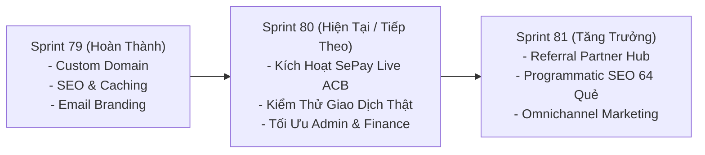

# BÁO CÁO TOÀN DIỆN SPRINT 79/80 & HỒ SƠ BÀN GIAO (HANDOVER ROADMAP)

**Dự án:** ViOS — Tử Vi Toàn Tập (`ziweiai-web`)  
**Tác giả:** Antigravity AI  
**Thời gian lập:** 12/09/2026  
**Trạng thái hệ thống:** ✅ **PRODUCTION LIVE & SECURED (https://tuvitoantap.online)**  
**Commit hiện tại:** `4cb6586` trên nhánh `main` (đã deploy Vercel thành công)  

---

## 1. MỤC TIÊU VÀ BỐI CẢNH (GOAL & CONTEXT)

Hệ thống ViOS đã hoàn tất giai đoạn phát triển tính năng và bước vào giai đoạn **Production Launch Hardening, Custom Domain Transition & Financial Integration**:
1. Chuyển đổi toàn diện sang tên miền chính thức: **`tuvitoantap.online`** (DNS Cloudflare, SSL Full, CORS, Vercel Aliases).
2. Xác minh tính toàn vẹn của Cơ sở dữ liệu Supabase **`galatuvi`** (`nachzhkeuzwiqmbtelrp.supabase.co`).
3. Chuẩn hóa hạ tầng thanh toán tự động **SePay Webhook** (kết nối tài khoản ACB `6384251098`, tương thích cả Test Mode lẫn Live Production).
4. Cập nhật đồng bộ hòm thư hỗ trợ thương hiệu **`contact@tuvitoantap.online`**, ẩn hoàn toàn email cá nhân của Đại Ka khỏi giao diện người dùng.
5. Thiết lập lộ trình bàn giao (Handover) rõ ràng để tiếp tục phiên làm việc mới cho **Sprint 80** (SePay Live & Admin Optimization) và **Sprint 81** (Marketing & Growth Engine).

---

## 2. NHỮNG VIỆC ĐÃ HOÀN THÀNH (WHAT WAS DONE)

### A. Hạ Tầng Tên Miền & Gỡ Lỗi DNS Cloudflare
- **Phát hiện & Xóa IP rác:** Gọi Cloudflare API xóa bản ghi A `76.223.105.230` (IP lạ gây lỗi Timeout 522/524 khi người dùng truy cập). Hiện tại DNS chỉ trỏ duy nhất về `76.76.21.21` (Vercel Anycast IP).
- **Gắn & Xác thực Domain Vercel:** Thêm và verify thành công cả `tuvitoantap.online` và `www.tuvitoantap.online` vào Vercel project `build` (`prj_xIloC8p3WLWP0gvHLBStRpKwF7Va`).
- **Đồng bộ hóa Aliases:** Mỗi bản build Production tự động gán song song cả 2 domain: `https://tuvitoantap.online` và `https://tuvitoantap.vercel.app`.

### B. Xác Minh Cơ Sở Dữ Liệu Supabase `galatuvi`
- Dùng **Supabase Management API** (`api.supabase.com/v1/projects`) xác thực:
  - **Project ID:** `nachzhkeuzwiqmbtelrp`
  - **Project Name:** **`galatuvi`**
  - **Chủ sở hữu:** `galaxypro710-stack's Org` (tài khoản gắn với `galaxypro710@gmail.com`)
  - **Region:** `ap-northeast-2` (Seoul), trạng thái: `ACTIVE_HEALTHY`
- Đảm bảo 100% database này thuộc quyền quản trị của Đại Ka.

### C. Tối Ưu Hóa & Sửa Lỗi Cấu Hình SePay Webhook
- **Phát hiện lỗi:** Trên Vercel Production trước đó biến `SEPAY_TESTMODE_API` và `SEPAY_WEBHOOK_SECRET` bị rỗng, dẫn đến việc SePay bắn webhook sẽ bị từ chối `401 Unauthorized`.
- **Đã khắc phục:** Đưa chuỗi API Token `PITNJMKYEW215CMUTLT8FOBGXCIPXD4VDPEHL7VU6ZDGJTFBIASQAGRYYKO2VQ5Y` lên Vercel Production và xóa secret rỗng.
- **Xác thực Webhook:** Kiểm thử thành công trên cả 2 domain (`tuvitoantap.online` và `tuvitoantap.vercel.app`):
  - Gửi sai token ➔ Trả về `401 Unauthorized` (Chặn giả mạo).
  - Gửi đúng token ➔ Trả về `400 Bad Request` (Đã lọt qua lớp bảo vệ, sẵn sàng đón payload).

### D. Chuẩn Hóa Email Hỗ Trợ Dự Án
- Cập nhật toàn diện sang **`contact@tuvitoantap.online`** tại:
  - [`apps/web/src/routes/(app)/terms/+page.svelte`](file:///Users/gray/Documents/bydone/tuvinew/ziweiai-web/apps/web/src/routes/%28app%29/terms/+page.svelte)
  - [`apps/web/src/routes/(app)/privacy/+page.svelte`](file:///Users/gray/Documents/bydone/tuvinew/ziweiai-web/apps/web/src/routes/%28app%29/privacy/+page.svelte)
  - [`apps/web/src/routes/privacy-policy/+page.svelte`](file:///Users/gray/Documents/bydone/tuvinew/ziweiai-web/apps/web/src/routes/privacy-policy/+page.svelte)
  - Bổ sung liên kết **"Liên Hệ Hỗ Trợ"** (`mailto:contact@tuvitoantap.online`) tại Footer [`apps/web/src/routes/(app)/+page.svelte`](file:///Users/gray/Documents/bydone/tuvinew/ziweiai-web/apps/web/src/routes/%28app%29/+page.svelte).
- Quét toàn bộ bundle tĩnh ➔ **0 kết quả** lộ `galaxypro710@gmail.com`.

---

## 3. KẾT QUẢ KIỂM THỬ THỰC TẾ (VERIFICATION RESULTS)

| Nội Dung Kiểm Tra | Kết Quả Thực Nghiệm | Trạng Thái |
|---|---|---|
| **Trang chủ `https://tuvitoantap.online`** | HTTP 200, Canonical tag chuẩn, Cloudflare SSL Full | ✅ **PASSED** |
| **Robots.txt & Sitemap.xml** | HTTP 200, Sitemap index đủ 25 URLs, Edge cache 1h | ✅ **PASSED** |
| **API Health & Features** | `GET /api/health` ➔ 200 OK (`{"service":"ziweiai-api","status":"ok"}`) | ✅ **PASSED** |
| **SePay Webhook Verification** | HTTP 400 (hợp lệ token) trên cả 2 domain | ✅ **PASSED** |
| **Svelte Check & ESLint** | 0 errors, 0 warnings trên toàn monorepo | ✅ **PASSED** |
| **Web Test Suite** | 79/79 files passed (412/412 tests passed) | ✅ **PASSED** |
| **E2E Playwright Smoke** | Test luồng đăng nhập & dashboard passed hoàn hảo (30.2s) | ✅ **PASSED** |
| **Vercel Production Deployment** | Status: ● Ready (`dpl_HruxBmRMk6uJvmGhXjm2kfxX3TRA`) | ✅ **PASSED** |

---

## 4. LỘ TRÌNH KẾ TIẾP: PHÂN CHIA SPRINT RÕ RÀNG

Để Đại Ka không bị nhầm lẫn và kiểm soát tiến độ dễ dàng:



### 🚀 SPRINT 80: SEPAY LIVE ACTIVATION, AUDIT & ADMIN RECONCILIATION
1. **Chuyển đổi SePay sang Live:**
   - Kết nối tài khoản ACB `6384251098` trên SePay Live.
   - Thêm biến `SEPAY_API_KEY` lên Vercel Production.
2. **End-to-End Live Transaction Testing:**
   - Thực hiện 1 giao dịch nạp tiền thật (10.000 VNĐ) qua mã VietQR.
   - Kiểm tra tốc độ cộng XU (mục tiêu: dưới 5 giây sau khi tiền vào tài khoản).
   - Kiểm tra đối soát tại trang quản trị giao dịch: `/admin/transactions`.
3. **Tối ưu hóa Admin Panel & Báo Cáo Tài Chính:**
   - Tối ưu trang `/admin/analytics` và `/admin/transactions`.
   - Kiểm tra biểu đồ doanh thu XU, tỷ lệ kích hoạt tài khoản thật và các chỉ số ARPU.
   - Rà soát các trường hợp biên (số tiền chuyển sai cú pháp, chuyển thừa/thiếu tiền).

### 📈 SPRINT 81: MARKETING STRATEGY, PROGRAMMATIC SEO & VIRAL GROWTH
1. **Kích hoạt Động Cơ Giới Thiệu (Referral Partner Engine):**
   - Đẩy mạnh chương trình cộng tác viên: nhận 10 - 20% XU khi bạn bè nạp tiền.
   - Hoàn thiện thẻ chia sẻ hoàng gia (Royal Share Card) tối ưu kích thước story cho TikTok, Facebook, Threads, Zalo.
2. **Chiến Lược Content & Programmatic SEO:**
   - Mở rộng các trang từ điển thuật số (Glossary Marketing): 14 Chính Tinh, 64 Quẻ Dịch, 78 Lá Bài Tarot, Thần Số Học từ 1 đến 33.
   - Tự động sinh sitemap mở rộng cho các bài luận giải mẫu để hút traffic tự nhiên từ Google Search.
3. **Chiến Dịch Truyền Thông & Tâm Lý Học Khách Hàng (Marketing Psychology):**
   - Áp dụng nguyên lý *Scarcity & Social Proof*: Thông báo số lượng người vừa lập lá số trong ngày.
   - Chuỗi quà tặng Tân Thủ: Tặng ngay 50 XU khi tạo tài khoản email và điểm danh ngày đầu.

---

## 5. MASTER PROMPT SẴN SÀNG CHO PHIÊN MỚI (COPY-PASTE READY)

Khi Đại Ka mở một phiên chat mới (New Session), chỉ cần copy đoạn prompt chuẩn dưới đây gửi cho AI:

```markdown
Chào em, anh là Đại Ka. Chúng ta tiếp tục dự án ViOS — Tử Vi Toàn Tập (ziweiai-web).

1. BỐI CẢNH & TÌNH TRẠNG HIỆN TẠI:
- Đã hoàn thành 100% Sprint 79: Tên miền chính thức https://tuvitoantap.online đã LIVE, DNS Cloudflare đã được dọn sạch, email hỗ trợ đã đổi sang contact@tuvitoantap.online, toàn bộ 6 Validation Gates và Playwright E2E test đều passed.
- Database Supabase đã xác minh: galatuvi (nachzhkeuzwiqmbtelrp.supabase.co) thuộc quyền sở hữu của Đại Ka.
- Báo cáo chi tiết và tài liệu bàn giao đã lưu tại:
  + docs/sprint-80-sepay-domain-handover-and-future-roadmap.md
  + docs/sepay-integration-and-live-deployment-guide.md
  + implementation_notes.html

2. NHIỆM VỤ CHÍNH CHO SESSION NÀY — BẮT ĐẦU SPRINT 80:
- Kích hoạt và kiểm thử SePay Live Production (kết nối ngân hàng ACB 6384251098).
- Hướng dẫn và kiểm tra giao dịch nạp tiền thật End-to-End, đối soát tự động cộng XU vào ví người dùng.
- Tối ưu hóa hệ thống Admin Dashboard (/admin/transactions và /admin/analytics).
- Chuẩn bị nền tảng cho Sprint 81 (Chiến lược Marketing, Growth Hacking, Programmatic SEO và Referral Engine).

Hãy áp dụng /vibe-engineering-workflow và /behavior-model-debugger, đọc tài liệu docs/sprint-80-sepay-domain-handover-and-future-roadmap.md và bắt đầu ngay!
```
