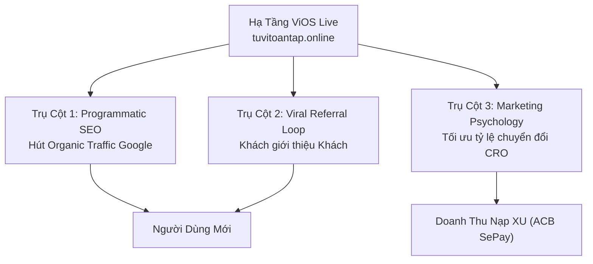

# BLUEPRINT CHIẾN LƯỢC SPRINT 81: MARKETING, PROGRAMMATIC SEO & REFERRAL VIRAL ENGINE

**Dự án:** ViOS — Tử Vi Toàn Tập (`ziweiai-web`)  
**Tác giả:** Antigravity AI  
**Thời gian lập:** 12/09/2026  
**Mục tiêu:** Chuyển hóa ViOS từ một nền tảng công nghệ hoàn thiện thành một cỗ máy thu hút người dùng tự động (Autonomous User Acquisition Engine), tận dụng sức mạnh của Programmatic SEO, Referral Growth Loops và Marketing Automation.

---

## 1. TỔNG QUAN CHIẾN LƯỢC (GROWTH STRATEGY OVERVIEW)

Sau khi hoàn thành Sprint 80 (Cổng thanh toán SePay Live ACB 6384251098 đã kích hoạt và đối soát thông minh), ViOS đã có đầy đủ hạ tầng tài chính để monetise. Sprint 81 tập trung vào 3 trụ cột tăng trưởng:

---

## 2. TRỤ CỘT 1: HỆ THỐNG PROGRAMMATIC SEO (DYNAMIC SITEMAP & GLOSSARY HUBS)

### A. Mục Tiêu SEO
Hút hàng chục ngàn lượt tìm kiếm không phải trả tiền (Organic Search) từ người dùng có nhu cầu tra cứu tử vi, kinh dịch, tarot và thần số học mỗi ngày.

### B. Cấu Trúc Nội Dung Programmatic SEO (Dự kiến 200+ Landing Pages)
1. **Từ Điển 14 Chính Tinh Tử Vi (`/glossary/stars/:slug`):**
   - Tử Vi, Thiên Cơ, Thái Dương, Vũ Khúc, Thiên Đồng, Liêm Trinh, Thiên Phủ, Thái Âm, Tham Lang, Cự Môn, Thiên Tướng, Thiên Lương, Thất Sát, Phá Quân.
   - Mỗi trang bao gồm: Ý nghĩa tại 12 cung, tổ hợp đắc hãm, sao đi kèm và Call-to-Action "Lập Lá Số Của Bạn Ngay".
2. **Thư Viện 64 Quẻ Kinh Dịch (`/glossary/iching/:slug`):**
   - Từ Quẻ 1 (Thuần Càn), Quẻ 2 (Thuần Khôn) đến Quẻ 64 (Hỏa Thủy Vị Tế).
   - Nội dung: Thoán từ, tượng quẻ, ý nghĩa trong sự nghiệp, tài lộc, gia đạo và gieo quẻ trực tuyến.
3. **Bộ Bài 78 Lá Tarot (`/glossary/tarot/:slug`):**
   - 22 Lá Major Arcana & 56 Lá Minor Arcana.
   - Ý nghĩa xuôi/ngược và nút "Rút Bài Dự Báo Tình Duyên Ngay".
4. **Thần Số Học Toàn Thư (`/glossary/numerology/:number`):**
   - Số Chủ Đạo từ 1 đến 33.
   - Sứ mệnh, bài học đường đời, năm cá nhân và liên kết với Bát Tự.

### C. Tự Động Hóa Sitemap & Schema Markup
- Script `generate-sitemap.ts` sẽ tự động quét danh mục bài viết và sinh sitemap đa tầng:
  - `sitemap-stars.xml`
  - `sitemap-iching.xml`
  - `sitemap-tarot.xml`
  - `sitemap-numerology.xml`
- Áp dụng chuẩn Google Structured Data: `Article`, `FAQPage`, `BreadcrumbList`.

---

## 3. TRỤ CỘT 2: ĐỘNG CƠ GIỚI THIỆU VIRAL (REFERRAL PARTNER ENGINE)

### A. Cơ Chế Thưởng Giới Thiệu (Incentive Structure)
- **Người được mời (Tân thủ):** Nhập mã hoặc bấm vào link giới thiệu ➔ Nhận ngay **20 XU Tân Thủ** để trải nghiệm luận giải AI.
- **Người giới thiệu (Partner):**
  - Nhận ngay **10 XU** khi bạn bè tạo tài khoản và xác thực email thành công.
  - Nhận hoa hồng trọn đời **20% số XU** mỗi khi bạn bè nạp tiền qua SePay VietQR (Tự động hạch toán vào bảng `xu_transactions` với `transaction_type = 'referral_bonus'`).

### B. Thẻ Chia Sẻ Hoàng Gia (Royal Share Cards) Tối Ưu Mạng Xã Hội
- Tạo component xuất ảnh đồ họa sang trọng kích thước chuẩn 9:16 (Story / Reels / TikTok) và 1:1 (Post):
  - Khắc họa tổng quan lá số, quẻ dịch vừa gieo hoặc lá bài Tarot vừa rút.
  - Tự động đính kèm Mã QR dẫn thẳng vào link giới thiệu: `https://tuvitoantap.online/share/ref/<REFERRAL_CODE>`.
- 1-Click chia sẻ trực tiếp sang: Facebook, Zalo, Telegram, WhatsApp hoặc tải ảnh PNG độ phân giải cao.

---

## 4. TRỤ CỘT 3: TÂM LÝ HỌC MARKETING & TỐI ƯU CHUYỂN ĐỔI (CRO)

1. **Hiệu Ứng Đám Đông (Social Proof & Live Pulse):**
   - Hiển thị widget thông báo nhẹ nhàng góc màn hình: *"Một người dùng tại Hà Nội vừa mở Luận Giải Tử Vi Chuyên Sâu"* (ẩn danh và tôn trọng riêng tư).
2. **Kích Thích Chuỗi Ngày (Daily Streak Gamification):**
   - Thưởng điểm danh 7 ngày liên tiếp: Ngày 1 (+5 XU) ➔ Ngày 7 (+25 XU + Huy Hiệu Khâm Thiên Giám).
3. **Phễu Chuyển Đổi Nạp Tiền Thần Tốc (Instant Frictionless Checkout):**
   - Gói Trải Nghiệm 10.000 VNĐ (= 10 XU) đã sẵn sàng giúp khách hàng vượt qua rào cản tâm lý nạp tiền lần đầu cực kỳ dễ dàng.

---

## 5. CHECKLIST CHUẨN BỊ KỸ THUẬT CHO SPRINT 81

- [ ] Tạo schema database cho thư viện Glossary: bảng `glossary_entries` hoặc markdown content collections.
- [ ] Xây dựng route động `/glossary/[category]/[slug]`.
- [ ] Tích hợp OpenGraph image generation động cho từng lá số và bài viết.
- [ ] Mở rộng bảng điều khiển đối tác tại `/admin/referrals` để theo dõi Top KOC/Affiliates có doanh thu nạp cao nhất.
- [ ] Bật tính năng Web Push / PWA Notification nhắc nhở điểm danh hàng ngày.
